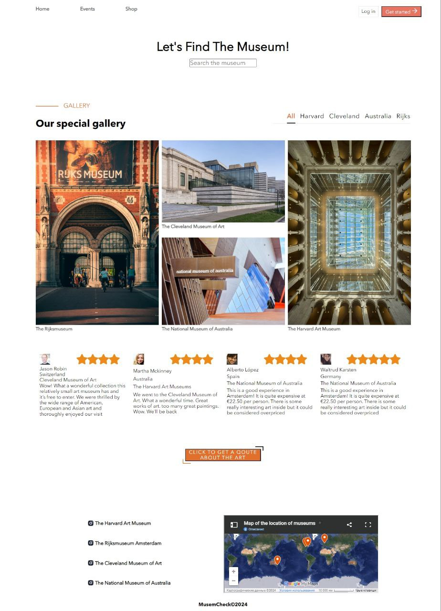

# museum

Museum is not just a website; it's a gateway to the art world, accessible to every internet user. Whether you're a passionate art enthusiast or a curious visitor, our site offers an engaging journey through the galleries of a virtual museum.

https://catborn.github.io/museum/

# Project Highlights:

- Interactive Experience: Engages users with dynamic content and smooth transitions.
- Accessibility: Designed to be accessible on various devices and screen sizes.
- Educational Value: Provides informative content about art and museum exhibitions.
- Visual Appeal: Showcases artworks in a visually stunning digital environment.

## [inspired by](<https://www.figma.com/design/8FnPPzsmVSH3YVhy7qDxu9/Museum-(Community)?node-id=0-1&t=QikRPyYesSp6pqCg-0>)
